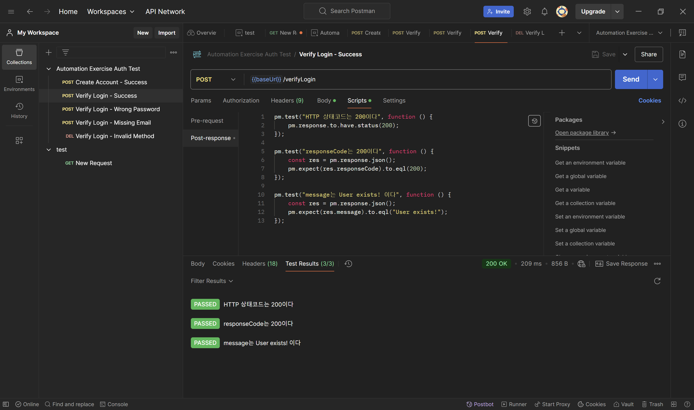
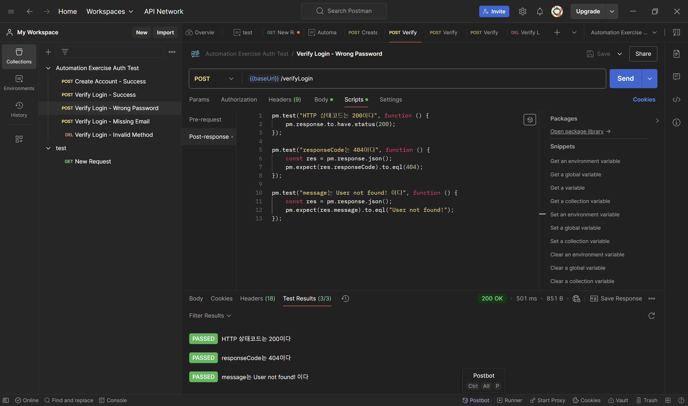
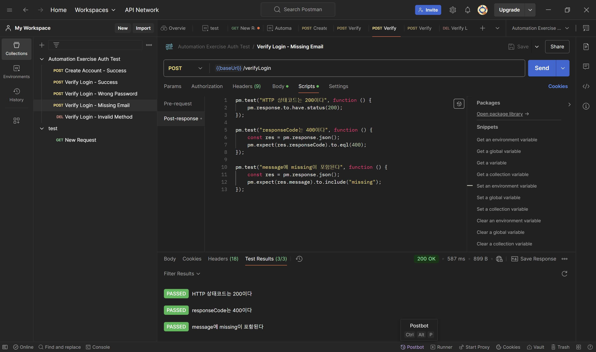

# Postman Auth API Test Project

Postman을 활용하여 회원가입/로그인 인증 API를 테스트하고,  
정상 및 예외 시나리오에 대해 자동 검증 스크립트를 적용한 QA 실습 프로젝트입니다.

---

## 프로젝트 소개
이 프로젝트는 Automation Exercise의 인증(Auth) 관련 API를 대상으로 Postman을 활용해 테스트한 QA 실습 프로젝트입니다.

회원가입과 로그인 API를 중심으로 정상/비정상 케이스를 설계하고,  
각 요청에 대해 응답 코드와 메시지를 검증하는 자동 테스트 스크립트도 함께 작성했습니다.

---

## 테스트 대상
- 회원가입(Create Account)
- 로그인 검증(Verify Login)

---

## 테스트 환경

| 항목 | 내용 |
|------|------|
| Tool | Postman |
| API Test Type | Manual + Automated Validation |
| Body Type | x-www-form-urlencoded |
| Variables | `{{baseUrl}}`, `{{testEmail}}`, `{{testPassword}}`, `{{testName}}` |

---

## 테스트 케이스 구성

| No | 테스트 케이스 | 목적 | 기대 결과 |
|----|--------------|------|----------|
| 1 | Create Account - Success | 정상 회원가입 요청 시 계정 생성 여부 확인 | `responseCode = 201`, `message = "User created!"` |
| 2 | Verify Login - Success | 정상 이메일/비밀번호 입력 시 로그인 검증 성공 확인 | `responseCode = 200`, `message = "User exists!"` |
| 3 | Verify Login - Wrong Password | 잘못된 비밀번호 입력 시 예외 응답 확인 | `responseCode = 404`, `message = "User not found!"` |
| 4 | Verify Login - Missing Email | 필수 파라미터(email) 누락 시 예외 처리 확인 | `responseCode = 400`, `message`에 `missing` 포함 |
| 5 | Verify Login - Invalid Method | 지원하지 않는 HTTP Method 요청 시 예외 처리 확인 | `responseCode = 405`, `message`에 `not supported` 포함 |

---

## 자동 검증 (Post-response Script)

각 요청에 대해 아래 항목을 Postman Script로 자동 검증했습니다.

- HTTP 상태코드 확인
- JSON 응답 파싱
- `responseCode` 값 확인
- `message` 값 또는 포함 문자열 확인

### 예시 코드

```javascript
pm.test("responseCode는 200이다", function () {
    const res = pm.response.json();
    pm.expect(res.responseCode).to.eql(200);
});
```

---

## 실행 결과 예시

### Verify Login - Success


### Verify Login - Wrong Password


### Verify Login - Missing Email


---

## 폴더 구조

```bash
postman-auth-test/
├── README.md
├── collections/
│   └── Automation-Exercise-Auth-Tests.postman_collection.json
├── environments/
│   └── Automation-Exercise-Env.postman_environment.json
└── docs/
    ├── 01_signup_success.png
    ├── 02_login_success.png
    ├── 03_login_wrong_password.png
    ├── 04_login_missing_email.png
    ├── 05_login_invalid_method.png
    ├── 06_login_success_test_results.png
    ├── 07_login_wrong_password_test_results.png
    ├── 08_login_missing_email_test_results.png
    ├── 09_login_invalid_method_test_results.png
    └── 10_signup_success_test_results.png
```

---

## 회고

이번 프로젝트를 통해 단순 요청 전송을 넘어서,  
정상/예외 시나리오를 구분하여 API 테스트를 설계하는 방법과  
응답 코드 및 메시지를 기준으로 검증 포인트를 정의하는 방법을 익혔습니다.

또한 Postman Scripts를 활용해 반복 가능한 자동 검증을 구현하면서  
수동 테스트와 자동 검증을 함께 구성하는 기본적인 API QA 흐름을 경험할 수 있었습니다.
